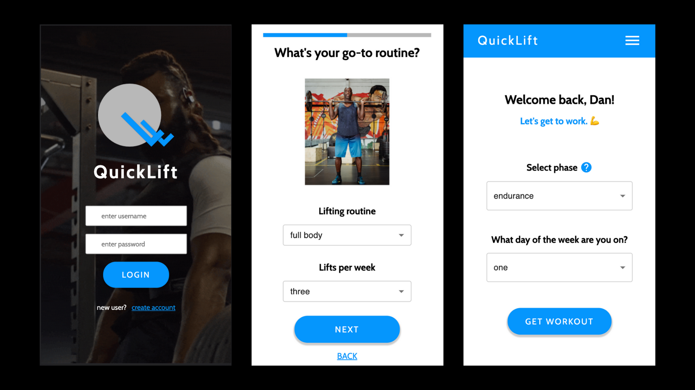

# QuickLift Workout Application

## Description

QuickLift is a powerful, never-before-seen workout application that prescribes its users a unique workout, or set of eleven exercises, every time they login and hit the gym. Exercises provided to the user factor in the user's equipment available, phase of the lifting journey they're in, and the target muscles they expect to be hitting in a given day of the week. Users can edit their preferences at any time and add exercise maxes to track their progress as they aim to reach their physical fitness potential. Get in and get out with ease with QuickLift.

## Wireframes

## Instructions

- New users are directed to an onboarding form to provide basic information, such as name, age, weight, height, their usual workout routine, and equipment available at their gym. Once the initial sign up form is complete, users are sent to the home page to get their daily workout.

- A navigation bar is located at the top of every page and can be clicked to travel between each view within the application (eg: workout, profile, or progress).

- Exercises given for a user's daily workout can be marked as complete and/or swapped if the exercise isn't currently available or desired by the user. Users can simply click the 'swap' icon provided with each exercise to execute this action.

- Question marks are located throughout the app and can be clicked on to receive more detail on the topic the icon is located next to. Once clicked, a pop-up will appear on the screen to provide more information.

- Users can add exercise maxes in the Progress page.  Maxes are organized by category and can be viewed by clicking on the name of any given category. Users can delete the max from their list by clicking the delete icon.

## What problem was solved?

QuickLift's biggest feature is its ability to prescribe a user with a unique workout that accounts for several variables relevant to them. This application eliminates the need for its user to manually write out a workout every time they go to the gym and allows them to switch out any exercise for a new exercise that works the same muscle group.

## The Process

Below are a few steps I took to ensure project satisfaction: 

- Created an intentional, well-defined project scope
    - See more on the scope of the project here: [QuickLift project scope](https://docs.google.com/document/d/19TiqLgKmLdcXswBZA9HOhtMHywwfonUk-DRF0WqVh9Y/edit?usp=sharing)
- Defined table relationships and built out queries to get, add, update, and remove data when actions are initiated by server
- Built and tested server-side logic that grabs 1,300-exercise database from an API and selects eleven unique exercises that reflects the user's preferences
- Transitioned from the server to the client to create the new user and existing user views 
- Setup reducers and sagas and test their connections with the API endpoints setup on the server
- Used SASS as primary form of styling for all views within the application, ensuring each view supported mobile and were responsive for all screen sizes
- Continued to build out additional views and refine functionality on both client and server, making modifications when necessary
- Testing, testing, and even more testing!

### Built using:
- JavaScript (client and server)
- React
- Redux
- Saga
- Node
- ExerciseDB API
- postgreSQL
- SASS
- HTML5
- Material UI  
- Figma (wireframes) 

## Duration

Prime students were given ~2.5 weeks for scoping, building, and refactoring their projects before presentation.

### Acknowledgement

This project is implemented into the curriculum taught at Prime Academy to strengthen our understanding of the full stack.

[ExerciseDB](https://rapidapi.com/justin-WFnsXH_t6/api/exercisedb/) API was used to provide all exercises given within the application.